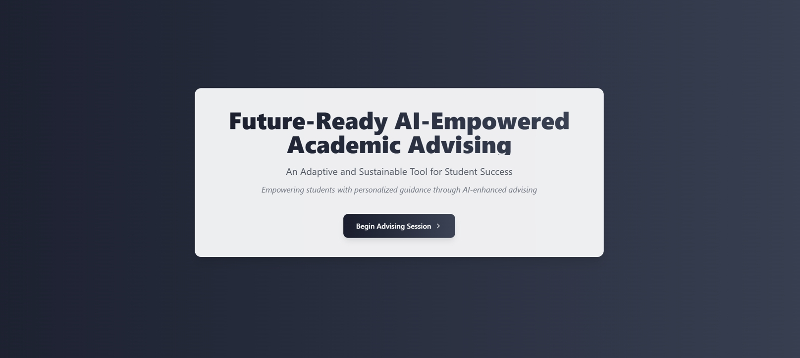
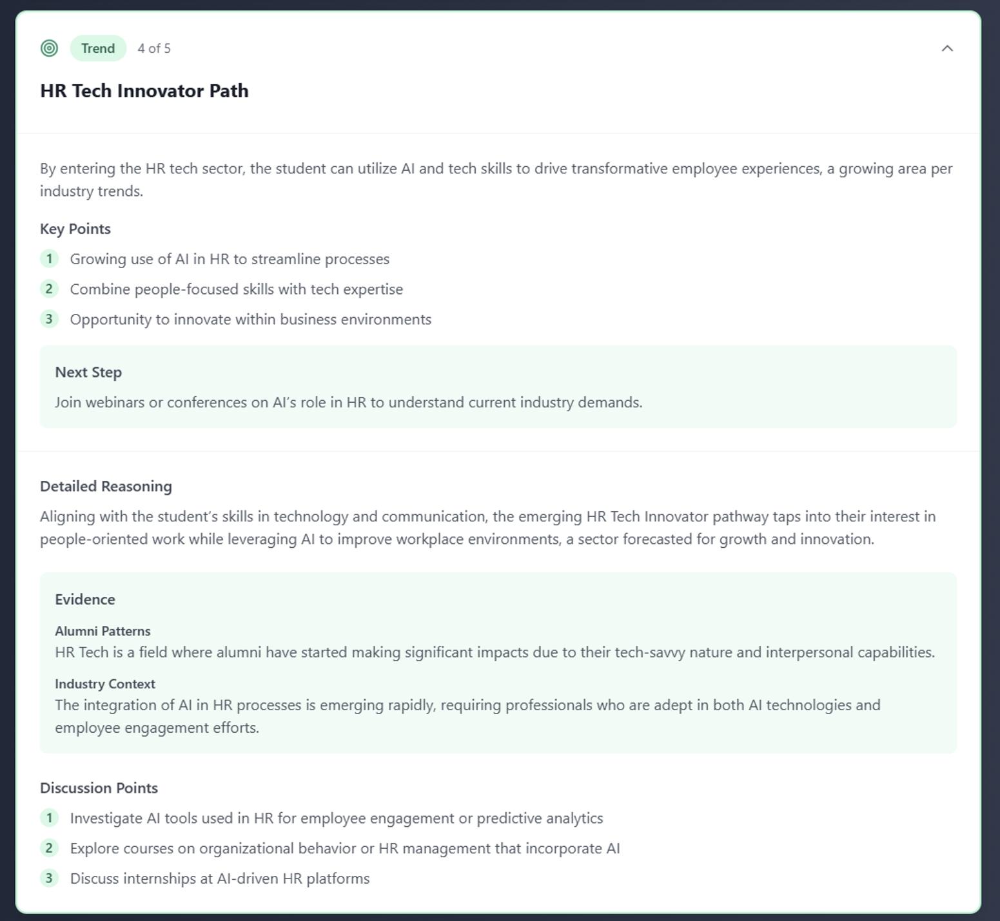
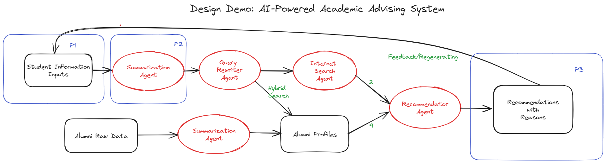

# FutureReady AI Advising

**FutureReady AI Advising** is a generative AI-powered tool that revolutionizes academic advising by providing personalized, adaptive, and explainable recommendations for students. Leveraging large language models (LLMs) and collaborative filtering, it delivers tailored guidance for courses, majors, and career pathways.


*FutureReady AI Advising landing page*

---

## 🚀 Features

### 🔍 Dynamic Student Profiles
- Generate comprehensive profiles using academic records, preferences, and career goals.
- Address data sparsity and cold start issues, ensuring robust recommendations even for new students.


*Example of student information and generated student profile*
- Generate comprehensive profiles using academic records, preferences, and career goals.
- Address data sparsity and cold start issues, ensuring robust recommendations even for new students.

### 💡 Explainable Recommendations
- Deliver context-rich suggestions backed by real-world alumni success stories.
- Provide transparent reasoning for recommendations, fostering trust and engagement.


*Expanded view of a recommendation example*
- Deliver context-rich suggestions backed by real-world alumni success stories.
- Provide transparent reasoning for recommendations, fostering trust and engagement.

### 🤝 Hybrid AI-Human Collaboration
- Blend AI-driven insights with human expertise for impactful decision-making.
- Ensure scalability without compromising the personalized touch of traditional advising.

---

## 🛠️ System Design

Our system ensures optimal recommendations and user experience through a well-structured workflow:


*FutureReady AI Advising system workflow*

Key highlights include:
- **Multi-agent Retrieval-Augmented Generation (RAG) Architecture**: Integrates real-time industry trends and alumni data to deliver accurate, context-aware recommendations.
- **Dynamic Profile Generation**: Synthesizes student and alumni information into narrative-style profiles for seamless matching.

---

## 💻 Tech Stack

- **Frontend**: Next.js
- **Backend**: Python with FastAPI
- **Database**: Vector databases (PostgreSQL with vector extensions or Pinecone)
- **AI Framework**: Multi-agent Retrieval-Augmented Generation (RAG) architecture

---

## 🏁 Getting Started

### 📋 Prerequisites
- Python 3.8+
- Node.js 16+
- PostgreSQL 13+

### 📦 Installation
1. **Clone the repository:**
   ```bash
   git clone https://github.com/yourusername/futureready-ai-advising.git
   cd futureready-ai-advising
   ```

2. **Install dependencies:**
   ```bash
   # Backend dependencies
   pip install -r requirements.txt

   # Frontend dependencies
   cd frontend
   npm install
   ```

3. **Database Setup:**
   - Ensure PostgreSQL is running and configured with vector extensions.
   - Import necessary schema or data if applicable.

### ▶️ Running the Application
Start both the web interface and backend server with:
   ```bash
   python run.py
   ```
   Access the application at: `http://localhost:3000`

---

## 📖 Research

This project is built on extensive research in AI-powered academic advising. Highlights include:
- A **Two-Stakeholder Evaluation Framework**: Assesses advisor usability metrics and student recommendation relevance.
- A focus on addressing modern advising challenges such as scalability and data sparsity.

For a deeper dive, check out our research paper:

[Innovator Group Research Paper](docs/Innovator_Group_Research.pdf)

---

## 🤝 Contributing

We welcome contributions from the community! Here’s how you can get involved:
- Review our [contributing guidelines](CONTRIBUTING.md).
- Suggest enhancements or participate in ongoing evaluations.

---

## 📜 License

This project is licensed under the MIT License. See the [LICENSE](LICENSE) file for details.

---

## 📬 Contact

For questions or support:
- Open an issue in this repository.
- Contact the maintainers directly.

---

Built with ❤️ by the **FutureReady AI Team**


